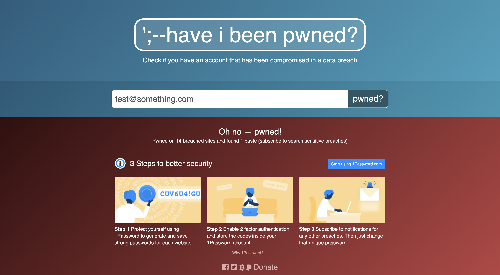
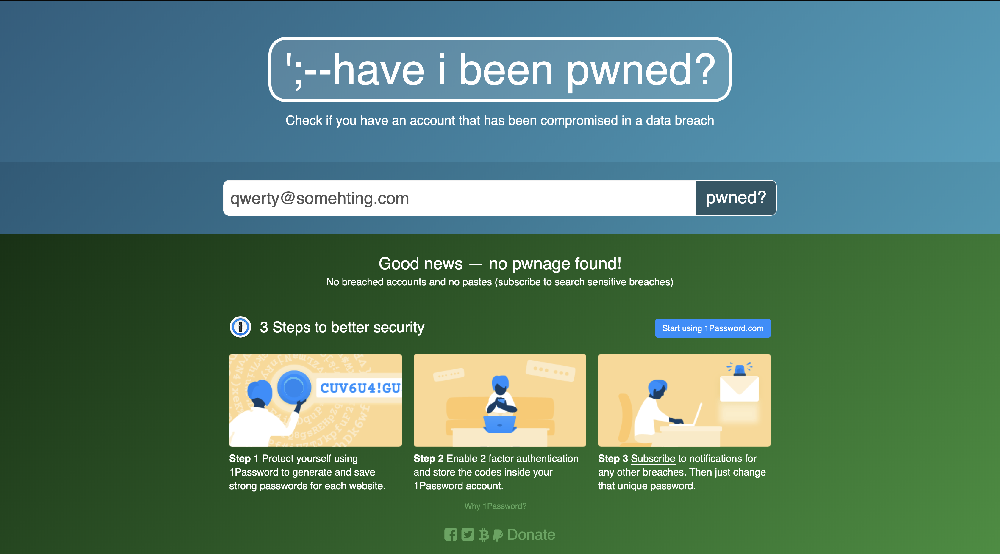

#### Challenge: Have I've been pwned
The objective of this exercise is to implement an automated test suit that covers the following two scenarios:

##### First scenario:
- Open https://haveibeenpwned.com/ with in a browser
- Type in email address: ``test@something.com``
- Check that website shows pwned-warning 

##### Second scenario:
- Open https://haveibeenpwned.com/ with in a browser
- Type in email address: ``qwerty@somehting.com``
- Check that website shows no pwned-warning 
- HINT: in case pwnd warning is shown you might need to use another fictional email adress that hasn't been pwned

#### Constraints:
- You provide an executable test suite (eg. via command line, selenium)
- You provide a clear documentation how to run the test suite
- You provide the code and/or configurations of your suite 

#### Extra/Bonus:
- You provide a Dockerfile to run the tests
- Your testsuite can check a list of emails in a loop and outputs a report which emails are pwned and which not
